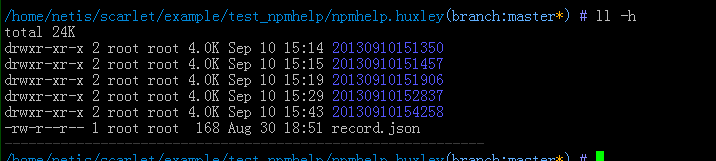
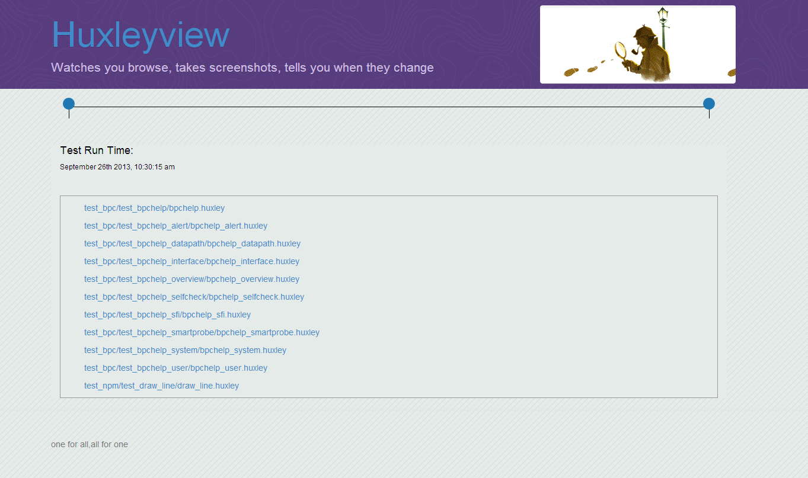
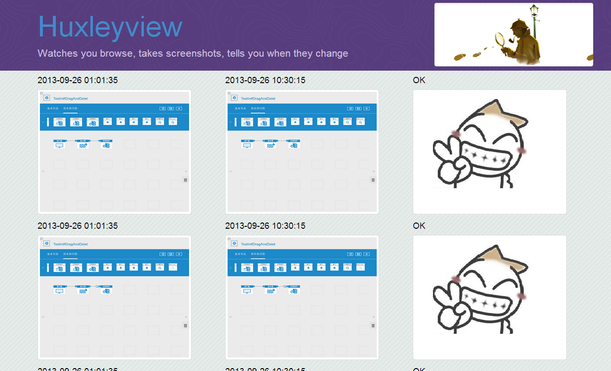

huxleyview
==========
huxley test result web view

what's huxleyview?
---------------------
[huxley](https://github.com/facebook/huxley) is a UI Test tools by taking screenshots.

I externed mode called "history mode":

in this mode, huxley will save screenshot to a folder named by current datetime after each test.
for exp: this is my 5 tests later

if you want to use history mode,just record and play in:

    `huxley -r -H`
    `huxley -p -H`

just download here:
https://github.com/memoryboxes/huxley

If you run huxley in history mode,you'll get all screenshots for each test,so you'll need a webUI to brower results.
That's what huxleyview show.

how to use?
---------------------
1. get huxleyview code.
     `git clone https://github.com/memoryboxes/huxleyview`

2. create link node in huxleyview/media/ to your huxley test result folder.
     `ln -s /Your-huxley-test-path  huxleyview/media/testproject`

3. runserver.
     `python manage.py runserver 0.0.0.0:80`

show
---------------------
visit http://x.x.x.x, just like:

you tests failed, huxleyview'll show it in red circle

you can click each testcase to see each screenshot diff:

